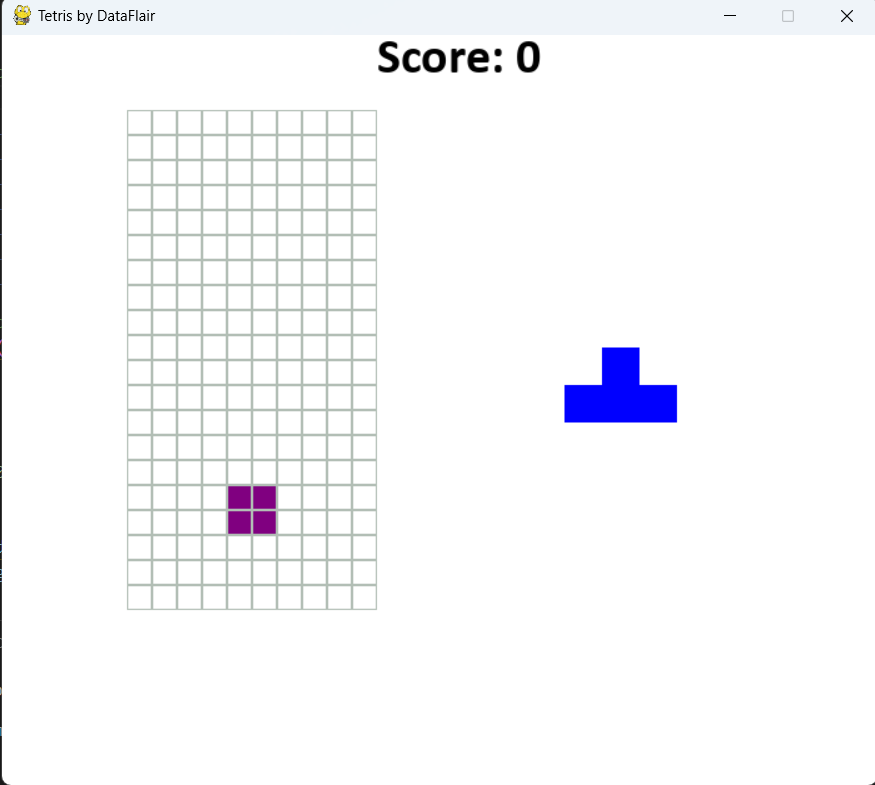

# Tetris Game by DataFlair

## Details
This is a classic Tetris game built using the `pygame` library in Python. Dive right into the nostalgic block-stacking game and show your prowess!

### Dependencies:
To run this game, you need to have `pygame` installed: pip install game.py

## Features
- Classic Tetris gameplay mechanics.
- Colorful and different shapes.
- Scoring system based on the number of lines cleared.
- A preview of the next shape to come.
- Game over detection.
- Responsive controls for seamless gameplay.

## Getting Started
1. Clone this repository: git clone https://github.com/Bisalkumar/Tetris_Game.git
2. Navigate to the directory: cd Tetris_game.py
3. Run the Tetris game: python game.py

## How to Use
- Use the **Arrow Keys** to move the blocks.
    - **Left Arrow**: Move block left.
    - **Right Arrow**: Move block right.
    - **Up Arrow**: Rotate block.
    - **Down Arrow**: Move block down faster.
    - **Space**: Drop block instantly.
- **ESC** Key: Restart the game.
- Stack the blocks neatly to clear rows and earn points!

## Screenshots

## Contributions
Contributions are welcome! Please fork this repository and open a pull request to add more features or fix any issues.

## License
This project is licensed under the MIT License - see the [LICENSE.md](LICENSE.md) file for details.

## Acknowledgements
- Thanks to `pygame` community for the awesome library.
- Shoutout to DataFlair for the game's inspiration.
